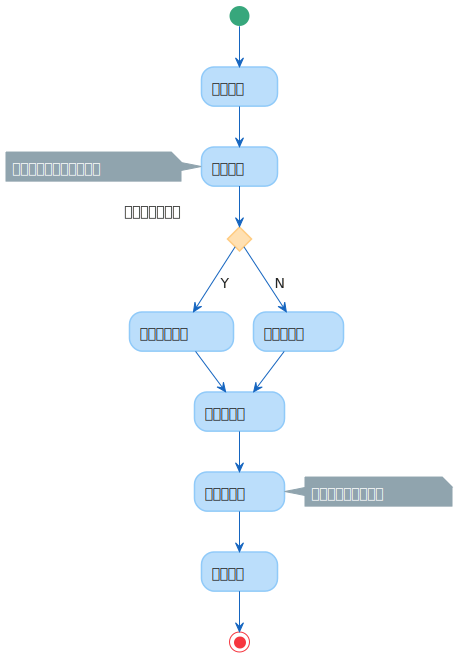
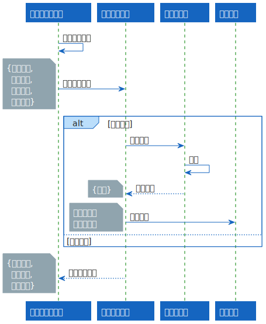
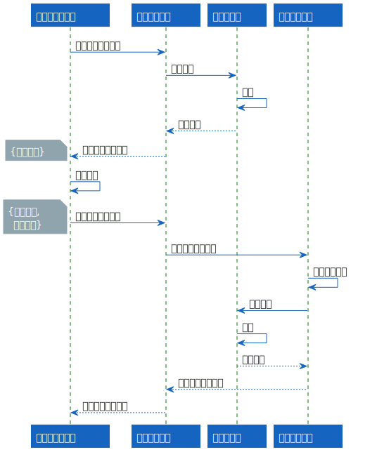
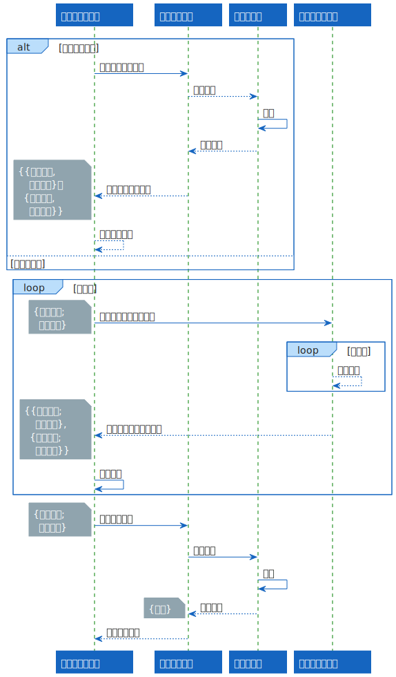
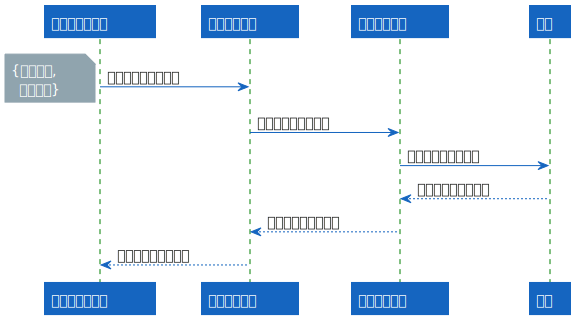
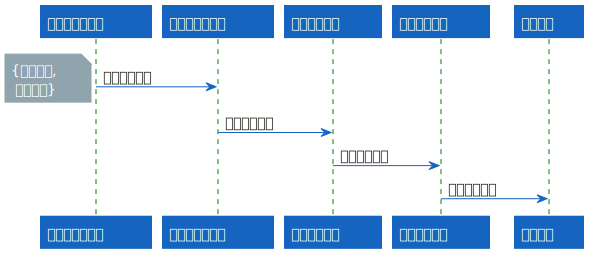

# 模拟训练软件设计文档

## 索引

- [1. 业务流程](#1业务流程)
    - [1.1. 流程概览](#11-流程概览)
    - [1.2. 业务详情](#12-业务详情)
        - [1.2.1. 任务创建](#121-任务创建)
        - [1.2.2. 模式切换](#122-模式切换)
        - [1.2.3. 想定编辑](#123-想定编辑)
        - [1.2.4. 目标初始化](#124-目标初始化)
        - [1.2.5. 光电引导](#125-光电引导)
- [2. 软件架构](#2-软件架构)
    - [2.1. 容器层](#21-容器层)
    - [2.2. 组件层](#22-组件层)
    - [2.3. 代码层](#23-代码层)
- [3. 软件接口](#3-软件接口)
    - [3.1. 添加雷达目标区域](#31-添加雷达目标区域)
        - [3.1.1. 接口描述](#311-接口描述)
        - [3.1.2. 接口参数](#312-接口参数)
        - [3.1.3. 接口样例](#313-接口样例)
    - [3.2. 初始化雷达信息](#32-初始化雷达信息)
        - [3.2.1. 接口描述](#321-接口描述)
        - [3.2.2. 接口参数](#322-接口参数)
        - [3.2.3. 接口样例](#323-接口样例)
    - [3.3. 发送光电引导指令](#33-发送光电引导指令)
        - [3.3.1. 接口描述](#331-接口描述)
        - [3.3.2. 接口参数](#332-接口参数)
        - [3.3.3. 接口样例](#333-接口样例)
- [4. 数据表](#4-数据表)
    - [4.1. 模拟训练任务表](#41-模拟训练任务表)
    - [4.2. 模拟训练方案表](#42-模拟训练方案表)
    - [4.3. 模拟训练设备表](#43-模拟训练设备表)
    - [4.4. 光电引导指令表](#43-光电引导指令表)

## 1. 业务流程

### 1.1. 流程概览



### 1.2. 业务详情

#### 1.2.1. 任务创建

下图为多个软件/组件同步实现“任务创建”功能的工作时序。



#### 1.2.2. 模式切换

下图为多个软件/组件同步实现“模式切换”功能的工作时序。



#### 1.2.3. 想定编辑

下图为多个软件/组件同步实现“想定编辑”功能的工作时序。



#### 1.2.4. 目标初始化

下图为多个软件/组件同步实现“装备电子目标初始化”功能的工作时序。



#### 1.2.5. 光电引导

下图为多个软件/组件同步实现“光电引导”功能的工作时序。



## 2. 软件架构

~~待补充~~

### 2.1. 容器层

~~待补充~~

### 2.2. 组件层

~~待补充~~

### 2.3. 代码层

~~待补充~~

## 3. 软件接口

### 3.1. 添加雷达目标区域

#### 3.1.1 接口描述

- 模拟训练软件编辑目标想定，雷达目标活动区域由“态势显示”模块划定。

- 具体通信方式待定。

#### 3.1.2. 接口参数

| Key | Type | Necessary | Description | Unit of Measure |
| :-: | :-: | :-: | :-: | :-: |
| URI | `string` | Y | 接口标识 | / |
| taskId | `uint32_t` | Y | 模拟训练任务编号 | / |
| devId | `string` | Y | 装备编号 | / |
| sectorArr | `json array` | Y | 扇区数组（扇区数 ≤ 16） | / |
| id | `uint8_t` | Y | 扇区编号（0 ~ 15） | / |
| beginAz | `uint16_t` | Y | 起始方位角（0 ~ 3600，正北为 0） | 0.01 度 |
| endAz | `uint16_t` | Y | 终止方位角（0 ~ 3600，正北为 0） | 0.01 度 |
| beginDist | `uint16_t` | Y | 起始距离 | 0.01 米 |
| endDist | `uint16_t` | Y | 终止距离 | 0.01 米 |

#### 3.1.3. 接口样例

```json
{
    "URI": "AddSector",
    "taskId": 47890,
    "devId": "LD007",
    "sectorArr": [
        {
            "id": 0,
            "beginAz": 1000,
            "endAz": 1050,
            "beginDist": 1024,
            "endDist": 2048
        },
        {
            "id": 1,
            "beginAz": 2000,
            "endAz": 2050,
            "beginDist": 2024,
            "endDist": 3048
        }
    ]
}
```

## 3.2. 初始化雷达信息

### 3.2.1. 接口描述

- 模拟训练软件通过“装备控制模块”，开启雷达的模拟训练模式，并初始化电子目标信息。

- 具体通信方式待定。

### 3.2.2. 接口参数

| Key | Type | Necessary | Description | Unit of Measure |
| :-: | :-: | :-: | :-: | :-: |
| URI | `string` | Y | 接口标识 | / |
| taskId | `uint32_t` | Y | 模拟训练任务编号 | / |
| devId | `uint32_t` | Y | 装备编号 | / |
| sectorArr | `json array` | Y | 扇区数组（扇区数 ≤ 16） | / |
| id | `uint8_t` | Y | 扇区编号（0 ~ 15） | / |
| beginAz | `uint16_t` | Y | 起始方位角（0 ~ 3600，正北为 0） | 0.01 度 |
| endAz | `uint16_t` | Y | 终止方位角（0 ~ 3600，正北为 0） | 0.01 度 |
| beginDist | `uint16_t` | Y | 起始距离 | 1 米 |
| endDist | `uint16_t` | Y | 终止距离 | 1 米 |
| humanNb | `uint8_t` | N | 人类数量（电子目标总数 ≤ 128） | 1 个
| vehicleNb | `uint8_t` | N | 机车数量（电子目标总数 ≤ 128） | 1 个
| UAVNb | `uint8_t` | N | 无人机数量（电子目标总数 ≤ 128） | 1 个
| animalNb | `uint8_t` | N | 动物数量（电子目标总数 ≤ 128） | 1 个

### 3.2.3. 接口样例

```json
{
    "URI": "InitRadar",
    "taskId": 47890,
    "devId": "LD007",
    "sectorArr": [
        {
            "id": 0,
            "beginAz": 1000,
            "endAz": 1050,
            "beginDist": 1024,
            "endDist": 2048,
            "humanNb": 20,
            "vehicleNb": 30
        },
        {
            "id": 1,
            "beginAz": 2000,
            "endAz": 2050,
            "beginDist": 2024,
            "endDist": 3048,
            "humanNb": 10,
            "UAVNb": 120
        }
    ]
}
```

### 3.3. 发送光电引导指令

#### 3.3.1. 接口描述

- “态势显示”模块发送光电引导指令给模拟训练软件，后者转发给“装备控制”模块。

- 具体通信方式待定。

#### 3.3.2. 接口参数

| Key | Type | Necessary | Description | Unit of Measure |
| :-: | :-: | :-: | :-: | :-: |
| URI | `string` | Y | 接口标识 | / |
| taskId | `uint32_t` | Y | 模拟训练任务编号 | / |
| infoArr | `json array` | Y | 引导信息数组 | / |
| devId | `string` | Y | 光电装备编号 | / |
| devLon | `uint32_t` | N | 光电装备经度（-180 ~ 180，E为正） | 0.0000001 度 |
| devLat | `uint32_t` | N | 光电装备纬度（-180 ~ 180，N为正） | 0.0000001 度 |
| devAlt | `uint32_t` | N | 光电装备海拔（绝对海拔） | 0.01 米 |
| tgtLon | `uint32_t` | Y | 雷达目标经度（-180 ~ 180，E为正） | 0.0000001 度 |
| tgtLat | `uint32_t` | Y | 雷达目标纬度（-180 ~ 180，N为正） | 0.0000001 度 |
| tgtAlt | `uint32_t` | Y | 雷达目标海拔（绝对海拔） | 0.01 米 |

#### 3.3.3. 接口样例

```json
{
    "URI": "GuideCamera",
    "taskId": 47890,
    "infoArr": [
        {
            "devId": "GD005",
            "tgtLon": 120.65912,
            "tgtLat": 30.56199,
            "tgtAlt": 20.69790,
        },
        {
            "devId": "GD006",
            "tgtLon": 120.62187,
            "tgtLat": 30.47650,
            "tgtAlt": 20.87576,
        }
    ]
}
```

## 4. 数据表

#### 4.1. 模拟训练任务表

数据表基本信息如下：

|  |  |
| :-: | :-: |
| **Table Name** | ST_TASK |
| **Primary Key** | TSAK_ID |
| **Table Constraints** | / |

数据表字段如下：

| Key | Type | Decsription| Column Constraints | Optional Value | Unit of Measure  |
| :-: | :-: | :-: | :-: | :-: | :-: |
| TASK_ID | `BIGSERIAL` | 模拟训练任务编号 | PRIMARY KEY | / | / |
| TASK_NAME | `VARCHAR(127)` | 任务名称 | NOT NULL<br>UNIQUE | / | / |
| TASK_DESC | `VARCHAR(127)` | 任务描述 | DEFAULT 'TASK_DESCRIPTION' | / | / |
| TASK_CREATE_TIME | `TIMESTAMP(3)` | 任务创建时间戳 | DEFAULT NOW() | / | / |
| TASK_START_TIME | `TIMESTAMP(3)` | 任务开始时间戳 | NOT NULL | / | / |
| TASK_END_TIME | `TIMESTAMP(3)` | 任务结束时间戳 | DEFAULT '1970-01-01 08:00:00.000' | / | / |
| TASK_MAX_DURATION | `BIGINT` | 任务预计最大时长 | NOT NULL<br>CHECK (TASK_MAX_DURATION > 0) | / | 1分钟 |

建表SQL如下：

```sql
CREATE TABLE ST_TASK (
    TASK_ID BIGSERIAL PRIMARY KEY,
    TASK_NAME VARCHAR(127) NOT NULL UNIQUE,
    TASK_DESC VARCHAR(127) DEFAULT 'TASK_DESCRIPTION',
    TASK_CREATE_TIME TIMESTAMP(3) DEFAULT NOW(),
    TASK_START_TIME TIMESTAMP(3) NOT NULL,
    TASK_END_TIME TIMESTAMP(3) DEFAULT '1970-01-01 08:00:00.000',
    TASK_MAX_DURATION BIGINT NOT NULL CHECK (TASK_MAX_DURATION > 0)
)
```

#### 4.2. 模拟训练方案表

数据表基本信息如下：

|  |  |
| :-: | :-: |
| **Table Name** | ST_PLAN |
| **Primary Key** | PLAN_ID |
| **Table Constraints** | / |

数据表字段如下：

| Key | Type | Decsription| Column Constraints | Optional Value | Unit of Measure  |
| :-: | :-: | :-: | :-: | :-: | :-: |
| PLAN_ID | `BIGSERIAL` | 方案编号 | PRIMARY KEY | / | / |
| TASK_ID | `INTEGER` | 模拟训练任务编号 | REFERENCES ST_TASK (TASK_ID) | / | / |
| PLAN_CREATOR_ID | `VARCHAR(20)` | 创建者编号 | REFERENCES XXCC_USER_INFO (USER_ROW_ID) | / | / |
| PLAN_NAME | `VARCHAR(127)` | 方案名称 | NOT NULL<br>UNIQUE | / | / |
| PLAN_DESC | `VARCHAR(127)` | 方案描述 | DEFAULT 'PLAN_DESCRIPTION' | / | / |
| PLAN_TYPE | `VARCHAR(63)` | 任务类型 | NOT NULL |  `MULTI_POST_REAL_TARGET`: 多哨所真实目标<br>`SINGLE_POST_REAL_TARGET`: 单哨所真实目标<br>`SINGLE_POST_VIRTUAL_RAND_TARGET`: 单哨所虚拟随机目标<br>`SINGLE_POST_VIRTUAL_GENE_TARGET`: 单哨所虚拟生成目标 | / |
| PLAN_SOURCE | `VARCHAR(63)` | 方案来源 | NOT NULL | `CMD_CENTER_<id>`: 指挥中心编号<br>`POST_<id>`: 哨所编号 | / |
| PLAN_FILE_URL | `VARCHAR(127)` | 方案文件地址 | NOT NULL | / | / |
| PLAN_CREATE_TIME | `TIMESTAMP(3)` | 方案创建时间戳 | DEFAULT NOW() | / | / |
| PLAN_START_TIME | `TIMESTAMP(3)` | 方案启动时间戳 | DEFAULT '1970-01-01 08:00:00.000' | / | / |
| PLAN_END_TIME | `TIMESTAMP(3)` | 方案终止时间戳 | DEFAULT '1970-01-01 08:00:00.000' | / | / |

建表SQL如下：

```sql
CREATE TABLE ST_PLAN (
    PLAN_ID BIGSERIAL PRIMARY KEY,
    TASK_ID INTEGER REFERENCES ST_TASK (TASK_ID),
    PLAN_CREATOR_ID varchar(20) REFERENCES XXCC_USER_INFO (USER_ROW_ID),
    PLAN_NAME VARCHAR(127) NOT NULL UNIQUE,
    PLAN_DESC VARCHAR(127) DEFAULT 'PLAN_DESCRIPTION',
    PLAN_TYPE VARCHAR(63) NOT NULL,
    PLAN_SOURCE VARCHAR(63) NOT NULL,
    PLAN_FILE_URL VARCHAR(127) NOT NULL,
    PLAN_CREATE_TIME TIMESTAMP(3) DEFAULT NOW(),
    PLAN_START_TIME TIMESTAMP(3) DEFAULT '1970-01-01 08:00:00.000',
    PLAN_END_TIME TIMESTAMP(3) DEFAULT '1970-01-01 08:00:00.000'
)
```

#### 4.3. ~~模拟训练设备表~~

数据表基本信息如下：

|  |  |
| :-: | :-: |
| **Table Name** | ST_DEV |
| **Primary Key** | AUTO_ID |
| **Table Constraints** | / |

数据表字段如下：

| Key | Type | Decsription| Column Constraints | Optional Value | Unit of Measure  |
| :-: | :-: | :-: | :-: | :-: | :-: |
| AUTO_ID |  | 自动生成的主键 | PRIMARY KEY | / | / |
| DEV_ID | `INTEGET` | 设备编号 | FOREIGN KEY | / | / |
| SUB_DEV_ID |  | 子设备编号 |  | / | / |
| TASK_ID | `INTEGER` | 模拟训练任务编号 | FOREIGN KEY | / | / |

#### 4.4. ~~光电引导指令表~~

数据表基本信息如下：

|  |  |
| :-: | :-: |
| **Table Name** | st_camera_guide |
| **Primary Key** | cmd_id |

数据表字段如下：

| Key | Type | Decsription | Unit of Measure | 
| :-: | :-: | :-: | :-: |
| cmd_id | `INTEGER` | 指令编号 | / |
| recv_time | `TIMESTAMP` | 指令接收时间 | / |
| forward_time | `TIMESTAMP` | 指令转发时间 | / |
| task_id | `INTEGER` | 任务编号 | / |
| dev_id | `INTEGER` | 光电装备编号 | / |
| longitude | `INT` | 目标经度（-180 ~ 180，E为正） | 0.0000001 度 |
| latitude | `INT` | 目标纬度（-180 ~ 180，N为正） | 0.0000001 度 |
| altitude | `INT` | 目标海拔（绝对海拔） | 0.01 米 |
