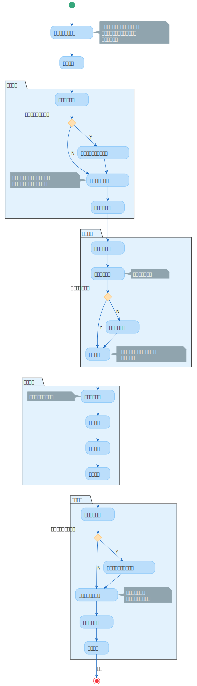

# 模拟训练软件工作时序

优先参照[模拟训练需求用例](http://yundoc.a20010.com/drive/group/16053/2075)

本节试图阐明使用STS进行一次模拟训练任务的流程，但并不代表软件真实的工作时序（多处存在**并发**执行情况）



<!-- ```plantuml
@startuml sts-work-sequence
'!include https://unpkg.com/plantuml-style-c4@latest/core.puml
' uncomment the following line and comment the first to use locally
!include plantuml-style-c4/core.puml

(*) -down-> 加载往期任务列表
note right: 任务编号，训练方案，评估方案，评估结果，训练过程信息，训练态势信息
-down-> 创建任务

partition 方案生成 {
    -down-> 创建训练方案
    if "参考往期训练方案？" then
        -down->[Y] 克隆往期训练方案内容
        -down-> 编辑训练方案内容
    else
        -down->[N] 编辑训练方案内容
    endif
    note left: 电子目标想定，参训装备想定，训练场景想定，过程控制想定
    -down-> 存储训练方案
}

partition 方案执行 {
    -down-> 解析方案内容
    -down-> 装备参数装订
    note right: 装备初始化设置
    if "随机电子目标？" then
        -down->[Y] 装备控制
    else
        -down->[N] 电子目标模拟
    endif
    -down-> 装备控制
    note right: 电子目标输入，引导装备探测，处置效果计算
}

partition 态势生成 {
    -down-> 物联信息收集
    note left: 装备信息，目标信息
    -down-> 态势生成
    -down-> 态势存储
    -down-> 态势展示
}

partition 训练评估 {
    -down-> 创建评估方案
    if "参考往期评估方案？" then
        -down->[Y] 克隆往期评估方案内容
        -down-> 编辑评估方案内容
    else
        -down->[N] 编辑评估方案内容
    endif
    note right: 评估算法选择，各个因素权重设置等
    -down-> 存储评估方案
    -down-> 训练评估
}

-down-> [结束] (*)

@enduml
``` -->

---

***未完待续***

---