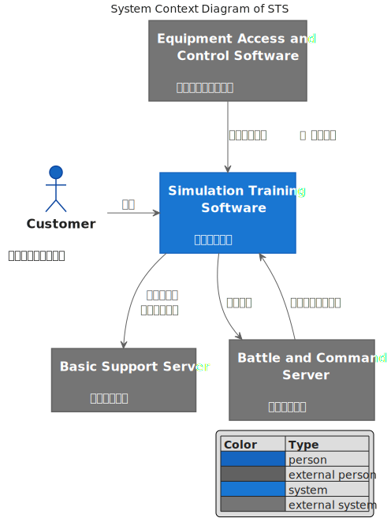
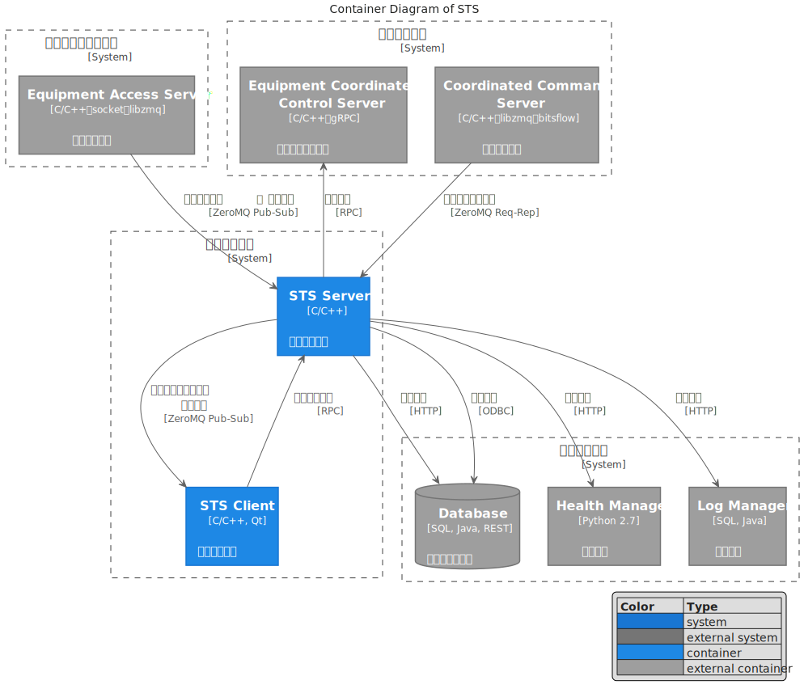
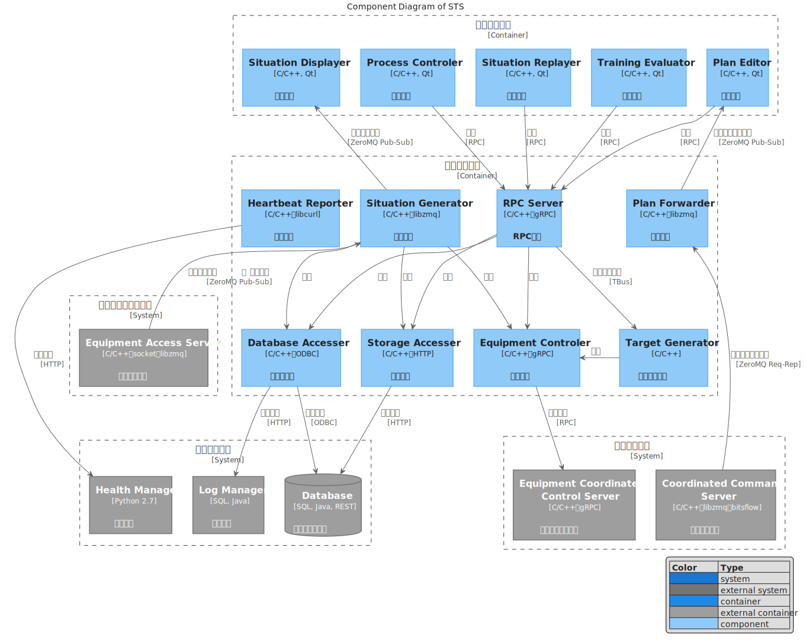

# 模拟训练软件架构

## Index

- [1. C4 Mode](#1-c4-mode)
    - [1.1. System Context](#11-system-context)
    - [1.2. Container](#12-container)
    - [1.3. Component](#13-component)
    - [1.4. Code](#14-code)

## 1. C4 Mode

本节描述了模拟训练软件（英语：Simulation Training Software，**STS**）的c4-mode架构。

### 1.1. System Context

下图描述了STS软件架构的第一层 —— **系统上下文**（system context）。



<!-- ```plantuml
@startuml sts-system-context

' !include https://unpkg.com/plantuml-style-c4@latest/c4_context.puml
' uncomment the following line and comment the first to use locally
!include plantuml-style-c4/c4_context.puml

LAYOUT_WITH_LEGEND()
' LAYOUT_AS_SKETCH()

title System Context Diagram of STS

Actor(customer, "Customer", "模拟训练软件操作员")

System(sts, "Simulation Training Software", "**模拟训练软件**")
System_Ext(bss, "Basic Support Server", "**基础支撑服务**")
System_Ext(eacs, "Equipment Access and Control Software", "**装备接入与控制软件**")
System_Ext(bcs, "Battle and Command Server", "**指挥控制服务**")

Rel_Neighbor(customer, sts, "**使用**")

Rel(sts, bss, "**上报心跳、使用存储服务**")
Rel(sts, bcs, "**控制装备**")
Rel(bcs, sts, "**发送联合训练方案**")
Rel(eacs, sts, "**发布装备信息**、**目标信息**")

@enduml
``` -->

### 1.2. Container

下图描述了STS软件架构的第二层 —— **容器**（container）。



<!-- ```plantuml
@startuml sts-container

' !include https://unpkg.com/plantuml-style-c4@latest/c4_container.puml
' uncomment the following line and comment the first to use locally
!include plantuml-style-c4/c4_container.puml

LAYOUT_TOP_DOWN
' LAYOUT_AS_SKETCH()
LAYOUT_WITH_LEGEND()

title Container Diagram of STS

System_Boundary(sts, "模拟训练软件") {
    Container(stss, "STS Server", "C/C++", "**模拟训练服务**")
    Container(stsc, "STS Client", "C/C++, Qt", "**模拟训练显控**")

    Rel(stss, stsc, "**发布联合训练方案、态势信息**", "ZeroMQ Pub-Sub")
    Rel(stsc, stss, "**使用后端服务**", "RPC")
}

System_Boundary(bss, "基础支撑服务") {
    ContainerDb_Ext(db, "Database", "SQL, Java, REST", "**信息存储与管理**")
    Container_Ext(hm, "Health Manager", "Python 2.7", "**健康管理**")
    Container_Ext(lm, "Log Manager", "SQL, Java", "**日志管理**")
}

System_Boundary(eacs, "装备接入与控制软件") {
    Container_Ext(eas, "Equipment Access Server", "C/C++，socket，libzmq", "**装备接入服务**")
}

System_Boundary(bcs, "作战指挥服务") {
    Container_Ext(ccs, "Coordinated Command Server", "C/C++，libzmq，bitsflow", "**协同指挥服务**")
    Container_Ext(eccs, "Equipment Coordinated Control Server", "C/C++，gRPC", "**装备协同控制服务**")
}

Rel_U(stss, eccs, "**控制装备**", "RPC")

Rel(eas, stss, "**发布装备信息**、**目标信息**", "ZeroMQ Pub-Sub")

Rel(stss, db, "**存取文件**", "HTTP")
Rel(stss, db, "**存取数据**", "ODBC")

Rel(stss, hm, "**上报心跳**", "HTTP")

Rel(stss, lm, "**写入日志**", "HTTP")

Rel(ccs, stss, "**发送联合训练方案**", "ZeroMQ Req-Rep")

@enduml
``` -->

### 1.3. Component

下图描述了STS软件架构的第三层 —— **组件**（component）。



<!-- ```plantuml
@startuml sts-component

' !include https://unpkg.com/plantuml-style-c4@latest/c4_component.puml
' uncomment the following line and comment the first to use locally
!include plantuml-style-c4/c4_component.puml

LAYOUT_WITH_LEGEND()
' LAYOUT_AS_SKETCH()

title Component Diagram of STS

Container_Boundary(stsc, "模拟训练显控") {
    Component(planEditor, "Plan Editor", "C/C++, Qt", "**方案编辑**")
    Component(situDislayer, "Situation Displayer", "C/C++, Qt", "**态势展示**")
    Component(situReplayer, "Situation Replayer", "C/C++, Qt", "**态势回放**")
    Component(trainingEvaluator, "Training Evaluator", "C/C++, Qt", "**训练评估**")
    Component(processControler, "Process Controler", "C/C++, Qt", "**过程控制**")
}

Container_Boundary(stss, "模拟训练服务") {
    Component(hbReporter, "Heartbeat Reporter", "C/C++，libcurl", "**心跳上报**")
    Component(planForwarder, "Plan Forwarder", "C/C++，libzmq", "**方案转发**")
    Component(situGenerator, "Situation Generator", "C/C++，libzmq", "**态势生成**")
    Component(tgtGenerator, "Target Generator", "C/C++", "**电子目标生成**")
    Component(rpcServer, "RPC Server", "C/C++，gRPC", "**RPC服务**")
    Component(equipmentControler, "Equipment Controler", "C/C++，gRPC", "**装备控制**")
    Component(dbAccesser, "Database Accesser", "C/C++，ODBC", "**数据库访问**")
    Component(storageAccesser, "Storage Accesser", "C/C++，HTTP", "**存储访问**")

    Rel_D(rpcServer, dbAccesser, "**调用**")
    Rel_D(rpcServer, storageAccesser, "**调用**")
    Rel_D(rpcServer, equipmentControler, "**调用**")
    Rel_D(rpcServer, tgtGenerator, "**发布目标想定**", TBus)

    Rel_D(situGenerator, dbAccesser, "**调用**")
    Rel_D(situGenerator, storageAccesser, "**调用**")

    Rel_L(tgtGenerator, equipmentControler, "**调用**")
    Rel_D(situGenerator, equipmentControler, "**调用**")
}

Rel(situReplayer, rpcServer, "**调用**", "RPC")
Rel(planEditor, rpcServer, "**调用**", "RPC")
Rel(processControler, rpcServer, "**调用**", "RPC")
Rel_D(trainingEvaluator, rpcServer, "**调用**", "RPC")
Rel_U(situGenerator, situDislayer, "**发布态势信息**", "ZeroMQ Pub-Sub")
Rel_U(planForwarder, planEditor, "**转发联合训练方案**", "ZeroMQ Pub-Sub")

System_Boundary(bss, "基础支撑服务") {
    ContainerDb_Ext(db, "Database", "SQL, Java, REST", "**信息存储与管理**")
    Container_Ext(hm, "Health Manager", "Python 2.7", "**健康管理**")
    Container_Ext(lm, "Log Manager", "SQL, Java", "**日志管理**")
}

System_Boundary(eacs, "装备接入与控制软件") {
    Container_Ext(eas, "Equipment Access Server", "C/C++，socket，libzmq", "**装备接入服务**")
}

System_Boundary(bcs, "作战指挥服务") {
    Container_Ext(ccs, "Coordinated Command Server", "C/C++，libzmq，bitsflow", "**协同指挥服务**")
    Container_Ext(eccs, "Equipment Coordinated Control Server", "C/C++，gRPC", "**装备协同控制服务**")
}

Rel_D(equipmentControler, eccs, "**控制装备**", "RPC")
Rel_U(eas, situGenerator, "**发布装备信息**、**目标信息**", "ZeroMQ Pub-Sub")
Rel(storageAccesser, db, "**存取文件**", "HTTP")
Rel(dbAccesser, db, "**存取数据**", "ODBC")
Rel(hbReporter, hm, "**上报心跳**", "HTTP")
Rel(dbAccesser, lm, "**写入日志**", "HTTP")
Rel(ccs, planForwarder, "**发送联合训练方案**", "ZeroMQ Req-Rep")

@enduml
``` -->

### 1.4. Code

下图描述了STS软件架构的第四层 —— **代码**（code）。本层应划分**命名空间**（namespace），构建主要的**类**（class）并梳理他们间的**关系**（继承、实现、聚合、组合、依赖、关联）~~，以及阐明各个类的实例共同工作的**时序**（sequence）~~。

<!-- ```plantuml
@startuml sts-code-diagram

' !include https://unpkg.com/plantuml-style-c4@latest/core.puml
' uncomment the following line and comment the first to use locally
!include plantuml-style-c4/core.puml
' !include https://unpkg.com/plantuml-style-c4@latest/class-diagram-helper.puml
' uncomment the following line and comment the first to use locally
!include  plantuml-style-c4/class-diagram-helper.puml

title Code Diagram of STS

@enduml
``` -->

---

***未完待续***

---

